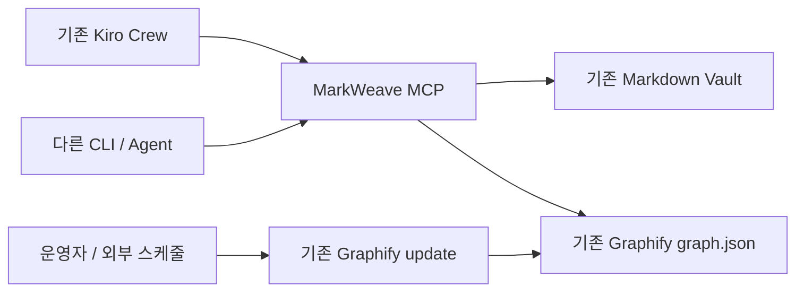

# MarkWeave MCP — 소형 구축 계획

## 1. 프로젝트 목표

MarkWeave는 기존 Markdown Vault와 Graphify 결과를 AI 도구에 연결하는 작은 MCP 서버입니다.

현재 운영 중인 Kiro Crew를 첫 번째 MCP Client로 사용합니다. 이후 Kiro CLI, Codex CLI, OpenCode, Claude Code 또는 다른 MCP Client도 동일한 서버에 연결할 수 있게 구성합니다.

```text
현재 Client
- 이미 운영 중인 Kiro Crew

향후 Client
- Kiro CLI
- Codex CLI
- OpenCode
- Claude Code
- 기타 MCP 지원 Agent
```

Markdown Vault가 원본이며 Graphify 결과는 파생 데이터입니다.

MarkWeave는 Kiro Crew의 설치, 인증, Telegram 연결, 대화 세션, 업그레이드와 운영을 담당하지 않습니다.

---

## 2. 전제 조건과 범위

다음 항목은 이미 준비된 것으로 간주합니다.

```text
Kiro Crew 실행 환경
kiro-cli login 인증
Kiro Crew Dashboard 또는 관리 인터페이스
Kiro Crew의 Telegram 또는 대화 채널
기존 Markdown Vault
기존 Graphify 산출물
```

이 계획에서 새로 구축하는 범위는 다음 하나입니다.

```text
MarkWeave MCP Server
```

Kiro Crew와 관련하여 수행하는 작업은 MarkWeave MCP Endpoint를 등록하고 Tool 호출을 검증하는 것뿐입니다.

---

## 3. 최종 구성



MarkWeave MCP는 다음 두 데이터만 연결합니다.

```text
Markdown Vault
Graphify graph.json
```

Graphify는 상시 서비스로 만들지 않습니다. 기존 Graphify 실행 방식으로 필요할 때 `graph.json`을 갱신합니다.

---

## 4. 역할 분리

### 4.1 Kiro Crew와 다른 AI Client

AI Client가 담당합니다.

```text
사용자와 대화
대화 문맥 유지
Markdown 검색이 필요한지 판단
기록할 내용인지 판단
적절한 MCP Tool 선택
최종 답변 생성
```

MarkWeave는 Client의 모델, Prompt 실행, 세션과 사용자 인터페이스를 관리하지 않습니다.

### 4.2 MarkWeave MCP

MarkWeave MCP가 담당합니다.

```text
Vault 내부 Markdown 검색
Markdown 읽기
안전한 Markdown 생성·추가·수정
기존 Graphify 결과 조회
경로 검증
동시 수정 방지
표준화된 MCP 결과 반환
```

MarkWeave MCP는 자체 대화 세션이나 장기 기억 시스템을 만들지 않습니다.

### 4.3 Graphify

기존 Graphify가 담당합니다.

```text
Markdown 관계 그래프 생성
graph.json 갱신
그래프 관계 데이터 제공
```

MarkWeave MCP는 Graphify 생성 로직을 다시 구현하지 않습니다.

---

## 5. MVP MCP Tool

초기 Tool은 다음 일곱 개로 제한합니다.

| Tool | 역할 |
|---|---|
| `search_notes` | 파일명과 Markdown 본문 검색 |
| `read_note` | 노트 본문과 현재 SHA-256 반환 |
| `create_note` | 새로운 Markdown 파일 생성 |
| `append_note` | 기존 노트 끝에 내용 추가 |
| `update_note` | 기존 노트 전체 내용을 안전하게 교체 |
| `query_graph` | 기존 Graphify 그래프 질의 |
| `graph_status` | Graph 파일 위치, 생성 시각, 최신 여부 확인 |

### 5.1 쓰기 규칙

`create_note`는 같은 경로의 파일이 이미 있으면 실패합니다.

`append_note`와 `update_note`는 다음 값을 요구합니다.

```text
path
content
expected_sha256
```

서버는 현재 파일의 SHA-256과 `expected_sha256`이 같을 때만 변경합니다.

변경은 같은 파일시스템에 임시 파일을 생성한 뒤 원자적으로 교체합니다.

### 5.2 초기 버전에서 제외하는 Tool

```text
delete_note
move_note
rename_note
bulk_update
graph_rebuild
shell_execute
임의 파일 읽기
```

삭제·이동·대량 수정은 생성·수정 기능이 안정화된 뒤 검토합니다.

---

## 6. Markdown 검색

처음에는 별도 데이터베이스를 사용하지 않습니다.

```text
파일명 검색
+
ripgrep 기반 본문 검색
```

검색 결과에는 다음 정보를 반환합니다.

```text
Vault 기준 상대 경로
제목
일치한 본문 일부
수정 시각
```

기본 제한을 둡니다.

```text
최대 검색 결과 수
결과당 최대 본문 길이
전체 응답 최대 크기
검색 timeout
```

Vault가 커져 실제 검색 속도나 정렬 품질이 문제가 될 때만 SQLite FTS5를 추가합니다.

---

## 7. Graphify 연결

### 7.1 조회 방식

`query_graph`는 다음 중 기존 Graphify 환경에 가장 잘 맞는 방식을 사용합니다.

```text
1순위: 기존 Graphify query 명령을 고정된 인자 배열로 실행
2순위: Graphify가 제공하는 공개 API 사용
3순위: 기존 Graphify MCP가 있다면 Tool을 중계
```

MarkWeave MCP는 Graphify의 내부 데이터 구조를 직접 복제하지 않습니다.

개념적인 CLI 호출은 다음과 같습니다.

```text
graphify query "<질의>" --graph <기존-graph.json>
```

실제 구현에서는 `shell=True`를 사용하지 않고 실행 파일과 인자를 배열로 전달합니다.

### 7.2 Graph 상태

`graph_status`는 최소한 다음 값을 반환합니다.

```json
{
  "available": true,
  "graph_path": "graphify-out/graph.json",
  "generated_at": "2026-08-13T00:00:00+09:00",
  "latest_markdown_mtime": "2026-08-13T09:30:00+09:00",
  "stale": true
}
```

Graph가 오래되거나 조회에 실패해도 Markdown 검색과 쓰기는 계속 동작합니다.

---

## 8. Graphify 갱신 정책

Markdown을 수정할 때마다 Graphify를 실행하지 않습니다.

```text
Markdown 변경
→ 파일에 즉시 반영
→ search_notes에서 즉시 검색 가능
→ Graphify는 별도 시점에 갱신
```

초기 운영은 다음 중 기존 환경에 맞는 방식을 유지합니다.

```text
수동 갱신
기존 cron
기존 systemd timer
기존 Graphify 자동화
```

MarkWeave MCP 내부에는 Scheduler와 Graph Worker를 만들지 않습니다.

Graphify 갱신에서는 다음 원칙을 유지합니다.

```text
증분 갱신 사용
기존 cache와 manifest 보존
graphify-out 디렉터리를 매번 삭제하지 않음
고빈도 폴더는 .graphifyignore로 제외
```

예를 들어 다음 폴더는 Graphify 대상에서 제외할 수 있습니다.

```gitignore
Assistant/Captures/
Daily/
Inbox/
Templates/
graphify-out/
```

관계 분석이 필요한 정리된 노트만 Graphify에 포함합니다.

---

## 9. AI Client용 동작 원칙

MarkWeave MCP는 대화의 의미를 분석하여 저장 여부를 결정하지 않습니다.

Kiro Crew Custom Agent 또는 다른 AI Client의 Prompt에 다음 원칙을 둡니다.

```text
1. 과거 기록과 관련된 질문은 search_notes 또는 query_graph를 먼저 사용합니다.
2. 명시적인 기억 요청, 확정된 결정, 해야 할 일만 Markdown에 기록합니다.
3. 일반 대화와 일시적인 질문은 기록하지 않습니다.
4. 기존 노트를 수정할 때는 read_note로 현재 내용과 SHA-256을 먼저 확인합니다.
5. Tool이 성공하지 않았으면 저장하거나 수정했다고 말하지 않습니다.
6. Markdown 변경 후 사용자에게 변경한 파일 경로를 알려줍니다.
7. 기존 노트의 의미를 크게 바꾸는 작업은 바로 적용하지 않고 사용자에게 확인합니다.
```

저장 판단 정확도가 낮으면 MCP 기능을 늘리기 전에 Agent Prompt와 Tool 설명을 조정합니다.

---

## 10. 보안 기준

### 10.1 경로

모든 파일 Tool은 Vault 기준 상대 경로만 받습니다.

```text
상대 경로 입력
→ 경로 정규화
→ Vault 루트와 결합
→ 최종 realpath 확인
→ Vault 루트 내부인지 확인
→ .md 확장자인지 확인
→ Vault 밖을 가리키는 symlink 차단
```

Vault 루트와 Graph 경로는 서버 설정에서만 지정합니다.

MCP 요청으로 이 경로를 변경할 수 없게 합니다.

### 10.2 파일

```text
UTF-8 사용
파일 크기 제한
검색 결과 수 제한
Tool 출력 크기 제한
SHA-256 기반 충돌 검사
같은 파일시스템에서 원자적 교체
```

### 10.3 프로세스

```text
Graphify query timeout
최대 stdout/stderr 크기
shell=True 사용 금지
사용자 입력으로 실행 파일 변경 금지
사용자 입력으로 Graph 경로 변경 금지
```

### 10.4 네트워크

MarkWeave MCP Endpoint는 기존 Kiro Crew가 접근할 수 있는 범위에만 공개합니다.

```text
같은 Docker Network
내부 서버 Network
127.0.0.1 + 별도 연결 방식
```

인터넷에 직접 공개하지 않습니다.

다른 Host의 Client가 연결해야 할 때만 HTTP 인증과 TLS를 추가합니다.

---

## 11. MCP Transport

MVP는 기존 Kiro Crew에서 연결하기 쉬운 Streamable HTTP를 기본으로 합니다.

```text
http://<markweave-mcp-address>:8000/mcp
```

주소는 기존 Kiro Crew의 배포 위치와 Network 구성에 맞게 결정합니다.

향후 로컬 CLI 연결이 필요하면 동일한 Tool 구현을 사용하는 stdio 진입점을 추가합니다.

```text
Streamable HTTP
- 기존 Kiro Crew
- 같은 Network의 여러 Client

stdio
- 로컬 CLI
- Client가 MCP 프로세스를 직접 실행하는 구성
```

처음부터 두 Transport를 모두 완성할 필요는 없습니다.

Kiro Crew 연결에 필요한 HTTP Transport를 먼저 구현합니다.

---

## 12. 기존 Kiro Crew 연결

Kiro Crew의 설치, 인증, 컨테이너, Volume과 Telegram 설정은 이 계획에 포함하지 않습니다.

MarkWeave 측에서 필요한 연결 절차만 수행합니다.

```text
1. MarkWeave MCP를 실행합니다.
2. Kiro Crew에서 접근 가능한 MCP URL을 확인합니다.
3. 기존 Kiro Crew에 Streamable HTTP MCP Server를 등록합니다.
4. 연결 Probe를 실행합니다.
5. 일곱 개의 MarkWeave Tool이 표시되는지 확인합니다.
6. MarkWeave 전용 Agent에 필요한 Tool만 허용합니다.
7. 검색·읽기·쓰기·Graphify 질의를 대화에서 검증합니다.
```

연결 예시는 다음과 같습니다.

```text
http://<markweave-mcp-address>:8000/mcp
```

MCP URL, Tool 이름과 Agent Prompt만 Kiro Crew 설정에 추가합니다.

Kiro Crew 전용 SDK나 REST API를 MarkWeave 코드에 포함하지 않습니다.

---

## 13. 권장 저장소 구조

```text
markweave-mcp/
├── src/
│   └── markweave_mcp/
│       ├── server.py
│       ├── vault.py
│       └── graphify.py
│
├── tests/
│   ├── test_paths.py
│   ├── test_search.py
│   ├── test_writes.py
│   └── test_graphify.py
│
├── pyproject.toml
├── .env.example
└── README.md
```

컨테이너 배포가 필요하다면 MarkWeave MCP용 `Dockerfile`만 선택적으로 추가합니다.

이 계획에는 Kiro Crew Dockerfile, Compose, 인증 스크립트와 운영 파일을 포함하지 않습니다.

다음 디렉터리와 구성도 만들지 않습니다.

```text
workers/
queues/
sessions/
memory/
notifications/
scheduler/
database/
web-ui/
kirocrew/
```

---

## 14. 구현 단계

### 1단계 — 읽기 전용 MCP

구현합니다.

```text
search_notes
read_note
query_graph
graph_status
Streamable HTTP
경로 검증
```

완료 기준:

> MCP Inspector에서 기존 Markdown과 Graphify 결과를 조회할 수 있습니다.

### 2단계 — 안전한 Markdown 쓰기

구현합니다.

```text
create_note
append_note
update_note
SHA-256 충돌 검사
원자적 쓰기
```

완료 기준:

> Vault 내부 Markdown만 생성·수정할 수 있고 외부 변경을 덮어쓰지 않습니다.

### 3단계 — 기존 Kiro Crew 연결

수행합니다.

```text
MCP URL 등록
연결 Probe
Tool Allowlist 적용
Custom Agent Prompt 적용
대화 기반 Tool 호출 테스트
```

완료 기준:

> 기존 Kiro Crew 대화에서 Markdown 검색과 필요한 기록이 수행됩니다.

### 4단계 — 다른 Client 검증

MCP를 지원하는 다른 CLI 하나에서 다음을 확인합니다.

```text
MCP 연결
노트 검색
노트 읽기
Graphify 질의
새 노트 생성
```

완료 기준:

> Kiro Crew 전용 코드 없이 동일한 MCP Tool을 사용할 수 있습니다.

---

## 15. 테스트 항목

| 테스트 | 기대 결과 |
|---|---|
| Vault 내부 노트 검색 | 관련 경로와 본문 일부 반환 |
| Graphify 질의 | 기존 `graph.json` 기준 결과 반환 |
| Graph가 오래된 상태 | `stale=true`, Markdown 기능은 정상 |
| 새 노트 생성 | 지정한 Vault 상대 경로에 생성 |
| 같은 경로 재생성 | 실패 |
| 잘못된 SHA-256으로 수정 | 충돌 오류 |
| `../` 경로 요청 | 거부 |
| Vault 밖 symlink 접근 | 거부 |
| Markdown 이외 파일 수정 | 거부 |
| Graphify query timeout | Tool 오류 반환, MCP 서버는 유지 |
| 기존 Kiro Crew에서 MCP Probe | 전체 Tool 목록 확인 |
| Kiro Crew에서 검색 질의 | `search_notes` 또는 `query_graph` 호출 |
| Kiro Crew에서 기억 요청 | 허용된 Markdown Tool 호출 |
| Kiro Crew가 중단된 상태 | Vault와 MarkWeave MCP에는 영향 없음 |
| 다른 CLI 연결 | 동일 Tool 사용 가능 |

---

## 16. MVP에서 제외하는 기능

```text
Kiro Crew 설치
Kiro Crew Docker Compose
kiro-cli login 자동화
Kiro Crew Volume 관리
Kiro Crew Telegram 설정
Kiro Crew 업그레이드
Telegram Bot 직접 개발
자체 대화 세션
자체 Memory Engine
SQLite FTS5
Vector DB
Filesystem Watcher
Job Queue
Worker 분리
Graphify 자동 갱신
Graph Version 관리
Undo 이력 DB
Markdown 삭제·이동
다중 사용자
별도 Web UI
Kubernetes
```

이 기능들은 MarkWeave MCP의 초기 범위에 포함하지 않습니다.

---

## 17. 확장 조건

| 기능 | 추가 조건 |
|---|---|
| SQLite FTS5 | ripgrep 검색이 느려지거나 결과 정렬이 부족할 때 |
| Graphify 갱신 요청 Tool | 기존 운영 방식만으로 수동 갱신이 불편할 때 |
| 변경 이력 DB | 파일 백업만으로 복구가 어려울 때 |
| 삭제·이동 Tool | 생성·수정 기능이 안정화되고 승인 방식이 정해졌을 때 |
| HTTP 인증 | 다른 Host나 신뢰할 수 없는 Network에서 접근해야 할 때 |
| stdio Transport | 로컬 CLI 연결이 실제로 필요할 때 |
| 별도 Worker | Graphify 질의나 파일 검색이 MCP 응답을 지속적으로 막을 때 |
| 다중 Vault | 실제로 두 번째 Vault를 연결할 때 |

---

## 18. 최종 완료 기준

다음 조건을 만족하면 1차 구축을 완료합니다.

1. MarkWeave MCP가 기존 Markdown Vault를 읽을 수 있습니다.
2. 기존 Graphify `graph.json`을 다시 만들지 않고 조회할 수 있습니다.
3. Markdown 검색·읽기·생성·추가·수정 Tool이 동작합니다.
4. Vault 밖 경로와 Markdown 이외 파일은 수정할 수 없습니다.
5. 기존 파일 변경에는 SHA-256 충돌 검사가 적용됩니다.
6. Markdown 변경이 Graphify 자동 실행을 유발하지 않습니다.
7. Graphify가 오래되거나 실패해도 Markdown 기능은 계속 동작합니다.
8. 기존 Kiro Crew에 MarkWeave MCP Endpoint가 등록됩니다.
9. Kiro Crew가 HTTP MCP를 통해 MarkWeave Tool을 사용할 수 있습니다.
10. 다른 MCP Client 하나에서도 같은 Tool을 사용할 수 있습니다.
11. Kiro Crew를 교체하거나 중단해도 Vault, Graphify와 MarkWeave MCP는 유지됩니다.

---

## 19. 최종 방향

프로젝트 범위는 다음 한 문장으로 정리합니다.

> MarkWeave는 기존 Markdown Vault와 Graphify를 안전한 MCP Tool로 제공하는 작은 서버이며, 이미 운영 중인 Kiro Crew는 이를 사용하는 첫 번째 MCP Client입니다.

처음에는 MCP 서버 하나만 구현합니다.

Kiro Crew의 배포와 운영, 대화 플랫폼, Telegram, 세션, AI 모델, Graphify 자동화는 MarkWeave 내부 기능으로 만들지 않습니다.
